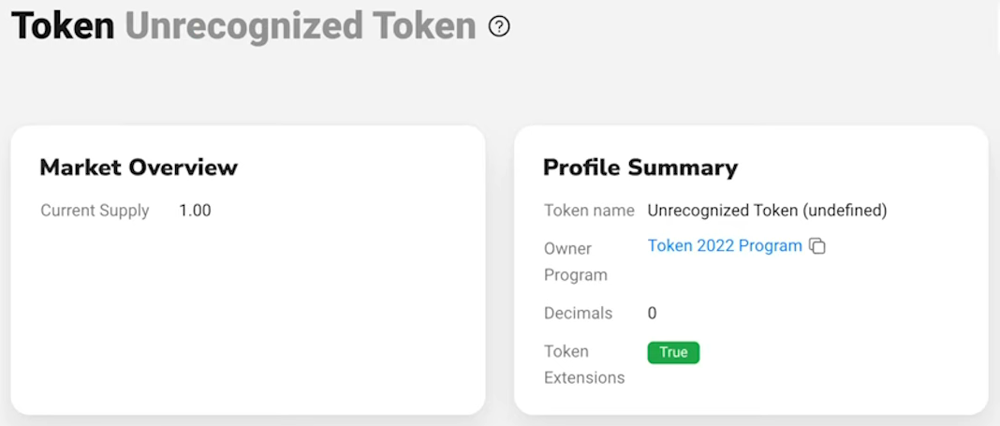

[Tutorial: Creating Dynamic NFTs with Token Extensions - Video Summary](https://www.youtube.com/watch?v=n-ym1utpzhk)

```
This is a transcription of a YouTube video. Among the relevant resources for learning to code, I found this video particularly interesting.

This content presents the opinions and perspectives of industry experts or other individuals.   The opinions expressed in this content do not necessarily reflect my opinion.

Readers are encouraged to verify the information on their own and seek professional advice before making any decisions based on this content.
```

--------


--------
# Introduction to Token Extensions Program for NFTs

In this section, the speaker introduces the **Token Extensions Program** for creating NFTs and adding metadata to enhance the NFTs' information, such as character data in a game.

## Creating and Minting NFTs

- Creating NFTs using the new token extensions program.
- [**`00:25`**](https://www.youtube.com/watch?v=n-ym1utpzhk?t=25) Minting an NFT by pressing a button.


- The minted NFT appears in the wallet after creation.


## Storing Metadata on Chain

- Storing metadata directly on-chain within the minted NFT.
- [**`00:52`**](https://www.youtube.com/watch?v=n-ym1utpzhk?t=52) Demonstrating how collecting wood in-game updates the **stored data in the NFT**.


- [**Solscan**](https://solscan.io/) does not fully support this feature yet.


- However it works with [**Solana Explorer**](https://explorer.solana.com/).


--------
[**`01:28`**](https://www.youtube.com/watch?v=n-ym1utpzhk?t=88) 
# Building an Onchain Program with Anchor

This section delves into building an on-chain program using **Anchor** for managing and updating metadata within created NFTs.


## Allocating Space for Mint Account

- Allocating space for the mint account within the program by using the **extension type** `ExtensionType::try_calculate_account_len()` function


- [**`01:44`**](https://www.youtube.com/watch?v=n-ym1utpzhk?t=104) Using extension types like metadata pointer to save additional metadata directly in the mint account


- [**`02:23`**](https://www.youtube.com/watch?v=n-ym1utpzhk?t=143) And you can also directly point it back to the mint and then you don't need to create another account for this.

- [**`02:30`**](https://www.youtube.com/watch?v=n-ym1utpzhk?t=150) Sometimes maybe you want to use the same method data account for like a bunch of different NFTs to save some space then you can do it. Also just point it to another account

## Initializing Metadata Pointer and Mint CPI

- Initializing metadata pointer before initializing the mint account.


- You can point to an address and there it expects to be the metadata

- [**`03:01`**](https://www.youtube.com/watch?v=n-ym1utpzhk?t=181) Assigning accounts to Token program and initializing metadata pointer with necessary details like **token ID** and **authority**.
- We use a **NFT PDA** for this, wich has a seed with `nft_authority`.

Then we put as a me**tadata address**, we let point back to the mint


- [**`04:08`**](https://www.youtube.com/watch?v=n-ym1utpzhk?t=248) The next we do, is initialize the **mint CPI**


## Creating Metadata of the NFD

- Creating actual metadata of the NFD including name, symbol, and URI link.
- [**`04:19`**](https://www.youtube.com/watch?v=n-ym1utpzhk?t=259) Defining specifics like **name** (Beaver), **symbol** (beaver), and **URI link** using a **Metaplex JSON** file uploaded to [**Arweave**](https://www.arweave.org/).


> Apparu en Juillet 2017, **Arweave est un protocole qui utilise la blockchain pour stocker des informations de manière sécurisée et permanente sur le web**. C’est ce que les fondateurs ont appelé le “permaweb”.

--------
[**`05:11`**](https://www.youtube.com/watch?v=n-ym1utpzhk?t=311) 
# Adding Additional Metadata Fields

Exploring how to add extra fields of metadata to an existing NFT through associated token accounts derived from signers.

## Customizing Additional Metadata Fields

- [**`05:19`**](https://www.youtube.com/watch?v=n-ym1utpzhk?t=319) Customizing additional metadata fields beyond standard parameters.


--------
# Creating and Minting NFTs

In this section, the speaker demonstrates how to create a normal account and mint an amount of a token program, defining an NFT. The process involves freezing the mint authority type to prevent additional token creation.


## Creating NFTs

- [**`06:05`**](https://www.youtube.com/watch?v=n-ym1utpzhk?t=365) Creating a normal **account** and **minting** an amount of a token program defines an NFT.
- Freezing the mint authority type prevents the creation of more tokens.

  
  

--------
[**`06:52`**](https://www.youtube.com/watch?v=n-ym1utpzhk?t=412) 
# Running Tests and Adding Metadata

This part focuses on running tests for the created NFT and adding metadata to enhance its properties, showcasing the flexibility in customizing NFT attributes.

## Running Tests

- Running tests using `anchor test` command without deploying additional programs.
- Easily verifying the created NFT in Solana Explorer by pasting the signature.
  
  

## Adding Metadata

- [**`07:33`**](https://www.youtube.com/watch?v=n-ym1utpzhk?t=453) Demonstrating how to add additional metadata fields like "wood" to customize NFT attributes.
  
- [**`07:59`**](https://www.youtube.com/watch?v=n-ym1utpzhk?t=479) We just call on the  `spl_token_metadata_interface::update_field()` with the program `spl_token_2022`.
  

--------
[**`08:11`**](https://www.youtube.com/watch?v=n-ym1utpzhk?t=491) 
# JavaScript Client Integration

The speaker delves into integrating NFT functionalities into a JavaScript client, highlighting its compatibility with creating compressed and normal NFTs.

## JavaScript Client Setup

- Utilizing a preset to create a Solana game with an anchor program supporting various types of NFTs.
  
- Mentioning Unity client's lack of support for certain features but encouraging potential integrations for enhanced functionality.

--------
# Transcription

- [00:00:00](https://www.youtube.com/watch?v=n-ym1utpzhk?t=0) ➜ Hello everybody today I want to show you how you can use the new token extensions program to create nfts and also how you
- [00:00:09](https://www.youtube.com/watch?v=n-ym1utpzhk?t=9) ➜ can add additional metadata to your nfds to sa for example specific data about your character in a game for example so like a level experience or some kind of
- [00:00:20](https://www.youtube.com/watch?v=n-ym1utpzhk?t=20) ➜ gold or in this case here wood so and the whole thing will be built in Anchor so it will be very easy to call it from the client to Mint an nft and also to
- [00:00:30](https://www.youtube.com/watch?v=n-ym1utpzhk?t=30) ➜ change it to add additional metadata so this here is a little example that I built so I can just press this mint nft button and you can see
- [00:00:38](https://www.youtube.com/watch?v=n-ym1utpzhk?t=38) ➜ that I can now Mint one of these little beavers here for 0.006 S and um then it will directly appear here in my wallet so I minted one earlier already and the
- [00:00:47](https://www.youtube.com/watch?v=n-ym1utpzhk?t=47) ➜ cool thing is now if I if I chop a tree here what this will do is calls a function on my program and um yeah we'll collect one wood so now the bber has
- [00:00:58](https://www.youtube.com/watch?v=n-ym1utpzhk?t=58) ➜ five wood and it takes it from this wood account here and it also costs one energy but the nice thing is now that this wood is actually now saved on chain
- [00:01:06](https://www.youtube.com/watch?v=n-ym1utpzhk?t=66) ➜ in the mint of this Beaver so you can see here he had four wood and now if I refresh this on Solana FM we can see that now he has five wood so now you
- [00:01:15](https://www.youtube.com/watch?v=n-ym1utpzhk?t=75) ➜ have like actually the data directly saved in the nft on chain which I think is really really cool um Soul scan does not really support this yet so for them
- [00:01:24](https://www.youtube.com/watch?v=n-ym1utpzhk?t=84) ➜ it just looks like an unrecognized token but in the Explorer this also works so if I reload this here in the the salana Explorer you can see now I also have
- [00:01:32](https://www.youtube.com/watch?v=n-ym1utpzhk?t=92) ➜ five wood here and now if I would shop another tree then it would go to six wood and so on and all of this is done uh in an onchain program which is
- [00:01:40](https://www.youtube.com/watch?v=n-ym1utpzhk?t=100) ➜ written in Anchor so let me show you how this works so first of all let's go here in the program so here we have the instruction which is called mint nft and
- [00:01:51](https://www.youtube.com/watch?v=n-ym1utpzhk?t=111) ➜ here on top we will start and walk through this so the first thing we need to do is we need to allocate some space for the mint account and this we do by
- [00:01:59](https://www.youtube.com/watch?v=n-ym1utpzhk?t=119) ➜ using the extension type try calculate length function and then we can add all the additional extension types here in our case here we only need the metadata
- [00:02:07](https://www.youtube.com/watch?v=n-ym1utpzhk?t=127) ➜ pointer and then we will save the metadata directly in the mint so we need to save some um allocate some extra space for that actually so the metadata
- [00:02:15](https://www.youtube.com/watch?v=n-ym1utpzhk?t=135) ➜ pointer works like this that you can point to an address and there it expects to be the metadata and but you can also directly point it back to the mint and
- [00:02:23](https://www.youtube.com/watch?v=n-ym1utpzhk?t=143) ➜ then you don't need to create another account for this so but there's use cases for both so sometimes maybe you want to use the same method data account
- [00:02:30](https://www.youtube.com/watch?v=n-ym1utpzhk?t=150) ➜ for like a bunch of different nfds to save some space then you can do it um also just point it to another account in our case we point it back to the mint
- [00:02:38](https://www.youtube.com/watch?v=n-ym1utpzhk?t=158) ➜ and then here we calculate the lamp parts that are required for this so first for the metadata and then for the for the metadata and the mint and then
- [00:02:47](https://www.youtube.com/watch?v=n-ym1utpzhk?t=167) ➜ for the extra space that we need for to save the metadata here we are just printing this out you could probably later remove this because um this costs
- [00:02:55](https://www.youtube.com/watch?v=n-ym1utpzhk?t=175) ➜ extra compute but then here we create the account and we put the rep L wordss and the space that we need then we um assign
- [00:03:04](https://www.youtube.com/watch?v=n-ym1utpzhk?t=184) ➜ this account to the Token program and then the next thing we do is we initialize our metadata pointer and this is something you need to do before you
- [00:03:13](https://www.youtube.com/watch?v=n-ym1utpzhk?t=193) ➜ initialize the mint actually otherwise it will not work so here we put the token ID then we put the mint and then we put the um Authority that we want for
- [00:03:22](https://www.youtube.com/watch?v=n-ym1utpzhk?t=202) ➜ this um for this extension and for the mint so and in my case um here we use then PDA for this so we just create this nft this PDA which has s a seed nft
- [00:03:33](https://www.youtube.com/watch?v=n-ym1utpzhk?t=213) ➜ Authority and um yeah I did it like this so that we can easily later in another instruction change this metadata because um you could also use the signer but
- [00:03:44](https://www.youtube.com/watch?v=n-ym1utpzhk?t=224) ➜ then the user who minted it will be the owner and the only one who can change it but how we wanted it want that the program will be able to change it so
- [00:03:51](https://www.youtube.com/watch?v=n-ym1utpzhk?t=231) ➜ that's why we use this uh nft PDA here nft Authority PDA to change the data and then we put as a metadata address we let point back to the mint like I just um
- [00:04:02](https://www.youtube.com/watch?v=n-ym1utpzhk?t=242) ➜ said earlier then we invoke this then the next thing we do here is we initialize the mint CPI so um here we just put the the address of the mint and
- [00:04:14](https://www.youtube.com/watch?v=n-ym1utpzhk?t=254) ➜ then we um call token program 22 initialize mint and we say this mint should have zero decimals because it's supposed to be an nft and our PDA will
- [00:04:23](https://www.youtube.com/watch?v=n-ym1utpzhk?t=263) ➜ be the authority and the freeze Authority we don't need in this case or we it yeah we said it to not done um yeah then this is how we get the sinus
- [00:04:32](https://www.youtube.com/watch?v=n-ym1utpzhk?t=272) ➜ for this PDA it's just um string and the bump and then we yeah we get the signer here and then here we use it and here we actually finally create the actual
- [00:04:42](https://www.youtube.com/watch?v=n-ym1utpzhk?t=282) ➜ metadata of the NFD so we say the name should be Beaver the symbol should be beaver and the URI is just um a normal metaplex um URL that I like metaplex
- [00:04:54](https://www.youtube.com/watch?v=n-ym1utpzhk?t=294) ➜ Json file that I uploaded to rwe and um yeah then we the signed and in this case now we need to have the signer because the like this PDA will be
- [00:05:05](https://www.youtube.com/watch?v=n-ym1utpzhk?t=305) ➜ the authority of this account and um yeah here you could actually like create your own standard now so like this doesn't need to be necessarily a
- [00:05:13](https://www.youtube.com/watch?v=n-ym1utpzhk?t=313) ➜ metaplex station there's also libx metaplex and there's like this tiny SPL standard so if you want to build something new now um yeah you can just
- [00:05:22](https://www.youtube.com/watch?v=n-ym1utpzhk?t=322) ➜ experiment here and create your own standard also for this in additional metadata Fields so this is how you now actually add another field to your nft
- [00:05:31](https://www.youtube.com/watch?v=n-ym1utpzhk?t=331) ➜ one additional metadata field so in this case I say the level should be one and um you could put all kind of key value pairs here you just need to keep in mind
- [00:05:41](https://www.youtube.com/watch?v=n-ym1utpzhk?t=341) ➜ that at some point if you put like a lot of them then you need to allocate a little bit more space earlier and then the next thing is here
- [00:05:48](https://www.youtube.com/watch?v=n-ym1utpzhk?t=348) ➜ we just create the associated token account which we derive from the signer and the associated token account and the authority will be our signer here and
- [00:05:58](https://www.youtube.com/watch?v=n-ym1utpzhk?t=358) ➜ this will be the mint and then we just need to put the system program and the token program so this is how you create a normal account and then we mint um one
- [00:06:06](https://www.youtube.com/watch?v=n-ym1utpzhk?t=366) ➜ amount of this mint to the associate token account of the people of the person who signs this so this is basically the definition of an nft right
- [00:06:14](https://www.youtube.com/watch?v=n-ym1utpzhk?t=374) ➜ you have one amount of a mint and the mint is frozen so this we do here so we say the mint Authority uh the mint Authority type mint tokens we set it to
- [00:06:24](https://www.youtube.com/watch?v=n-ym1utpzhk?t=384) ➜ none so there will be no possibility to uh create more of these tokens and here can see all the accounts and here you can see for example like um the PDA so
- [00:06:33](https://www.youtube.com/watch?v=n-ym1utpzhk?t=393) ➜ and now I want to quickly run the test so we call an anchor test minus skip local validator I do skip local validator because I have the validator
- [00:06:44](https://www.youtube.com/watch?v=n-ym1utpzhk?t=404) ➜ running here in the background and you can see you can very easily also run this locally you don't need to deploy any other programs for
- [00:06:52](https://www.youtube.com/watch?v=n-ym1utpzhk?t=412) ➜ this so I can just copy this signature here uh I open the salana Explorer I set it to local post I paste the signature and here you can see this is now our
- [00:07:04](https://www.youtube.com/watch?v=n-ym1utpzhk?t=424) ➜ created um nftd and here we can see on the mint two to the Token we can see it's an unknown token currently and the metadata is beaver and we have this
- [00:07:14](https://www.youtube.com/watch?v=n-ym1utpzhk?t=434) ➜ additional metadata which is level one and here you can put all kinds of different data so I think this is really cool and I want to show you now like for
- [00:07:22](https://www.youtube.com/watch?v=n-ym1utpzhk?t=442) ➜ example when I chop it tree which I showed you earlier in the app we can now very easily just add um another field here so for that wejust call on the
- [00:07:32](https://www.youtube.com/watch?v=n-ym1utpzhk?t=452) ➜ metadata interface update field with the program token 2022 but this could theoretically now since this is an interface also be another token program
- [00:07:43](https://www.youtube.com/watch?v=n-ym1utpzhk?t=463) ➜ that you deploy yourself so everyone can now basically create their own token programs if they want to I will stick with um this one because it's um it's um
- [00:07:51](https://www.youtube.com/watch?v=n-ym1utpzhk?t=471) ➜ safe and I know what it does but it's very easily now to just create a new field and in this case I call um I call it wood and I say the field wood should
- [00:08:01](https://www.youtube.com/watch?v=n-ym1utpzhk?t=481) ➜ be set to the wood that the player currently owns then you can see here in the slana FM that you can see this actually on chain in the token mint so I
- [00:08:11](https://www.youtube.com/watch?v=n-ym1utpzhk?t=491) ➜ think this is really really cool and now I want to show you quickly how this looks like in the JavaScript client so this is um nextra s app that I prepared
- [00:08:19](https://www.youtube.com/watch?v=n-ym1utpzhk?t=499) ➜ here using the preset create Solana game this will create you an anchor program a JavaScript client that supports compressed nfts and normal nfts and now
- [00:08:28](https://www.youtube.com/watch?v=n-ym1utpzhk?t=508) ➜ also minting nfds and it will also create the unity client sadly the unity client doesn't support this yet so if someone wants to build this it would
- [00:08:37](https://www.youtube.com/watch?v=n-ym1utpzhk?t=517) ➜ actually be really cool so someone could now go in and like um add an integration for the Das API for example and implement the token 22 program and then
- [00:08:45](https://www.youtube.com/watch?v=n-ym1utpzhk?t=525) ➜ this would also directly work from a Unity client so if someone wants to do this just contact the magic block team I I'm sure they will be happy if someone
- [00:08:53](https://www.youtube.com/watch?v=n-ym1utpzhk?t=533) ➜ like open APR for this um yeah but here I want to show you how easy it is now to to Mint this so all you need to call and on the program is mint nft you need to
- [00:09:01](https://www.youtube.com/watch?v=n-ym1utpzhk?t=541) ➜ put the S up like all the different programs and then the nft authority which you can just um derive like any other PDA just from the string and the
- [00:09:11](https://www.youtube.com/watch?v=n-ym1utpzhk?t=551) ➜ program ID so yeah I think this is um really nice let me quickly show you how you would now chop at three if you chop at three you just put the normal data
- [00:09:20](https://www.youtube.com/watch?v=n-ym1utpzhk?t=560) ➜ and you at the nft authority and also the mint of the nftd and then the program will be able to add this additional metadata here so if you now
- [00:09:30](https://www.youtube.com/watch?v=n-ym1utpzhk?t=570) ➜ want to use this to um create a collection this is certainly not yet available this will be coming out in Solana 1.18 so um but then if you want
- [00:09:39](https://www.youtube.com/watch?v=n-ym1utpzhk?t=579) ➜ to create a collection then you would use the group pointer extension so basically you create a group and you create a member and then the group
- [00:09:48](https://www.youtube.com/watch?v=n-ym1utpzhk?t=588) ➜ points to the member and the member points to the group and this is how a collection will be defined how I did this in this example here is actually
- [00:09:56](https://www.youtube.com/watch?v=n-ym1utpzhk?t=596) ➜ all the nfts I filter them by The Authority which is able to change them so this is also like grouping them all together um but it's not really a
- [00:10:06](https://www.youtube.com/watch?v=n-ym1utpzhk?t=606) ➜ collection but um theoretically like Phantom could now also um group all the nfts by the update Authority yeah so this is how these nfts currently look
- [00:10:15](https://www.youtube.com/watch?v=n-ym1utpzhk?t=615) ➜ like in Phantom so you can see that um the metadata pointer extension is already supported here but they don't really show the additional metadata yet
- [00:10:23](https://www.youtube.com/watch?v=n-ym1utpzhk?t=623) ➜ but they I'm sure they will eventually and so will the other wallets and yeah what you can do now is you can for example um save the level and the
- [00:10:30](https://www.youtube.com/watch?v=n-ym1utpzhk?t=630) ➜ experience of the player directly in the Min and then you could for example um like work together with the marketplaces like magic Eden or tensor or all the
- [00:10:38](https://www.youtube.com/watch?v=n-ym1utpzhk?t=638) ➜ other ones and you can like say like hey I want to also sort my nfds by in one of the metadata Fields right it's just like a key value store so they could for
- [00:10:47](https://www.youtube.com/watch?v=n-ym1utpzhk?t=647) ➜ example you could sort them by level and then the level 99 character may be weigh more than the level 30 character for example you could also have like a sword
- [00:10:56](https://www.youtube.com/watch?v=n-ym1utpzhk?t=656) ➜ in there or resources that are used for crafting or so on and um you could also create a new standard now that like let's say like one of the fields is for
- [00:11:05](https://www.youtube.com/watch?v=n-ym1utpzhk?t=665) ➜ example image uncore URL and then this tells all the vets and explorers and so on to load this um image and then you could for example have a character which
- [00:11:15](https://www.youtube.com/watch?v=n-ym1utpzhk?t=675) ➜ like evolves for example uh his graphical appearance also depending on his level so yeah I think there are tons of cool possibilities and if you want to
- [00:11:24](https://www.youtube.com/watch?v=n-ym1utpzhk?t=684) ➜ try out this example I will upload it to salana developers SL toen toen 22 next week and then you will be able to just download it and there's a extra as
- [00:11:34](https://www.youtube.com/watch?v=n-ym1utpzhk?t=694) ➜ JavaScript client in there you can run the test locally for the anchor program you can also try out the unity project and yeah maybe you find the time to um
- [00:11:43](https://www.youtube.com/watch?v=n-ym1utpzhk?t=703) ➜ make it also work in the unity project because I didn't get to that yet so that would be really cool you can just open a PR here and um yeah please um try it out
- [00:11:51](https://www.youtube.com/watch?v=n-ym1utpzhk?t=711) ➜ and um have fun with it and see you guys next time bye-bye 
